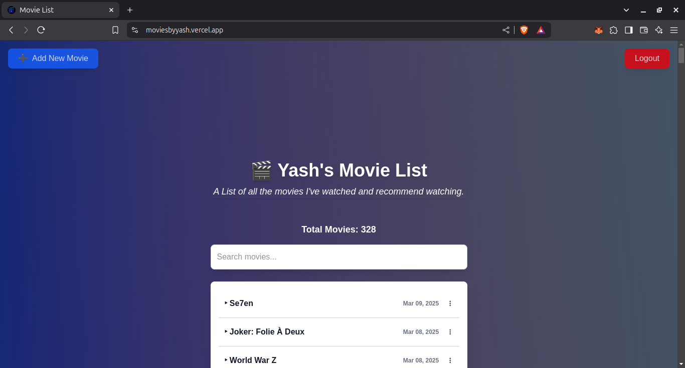
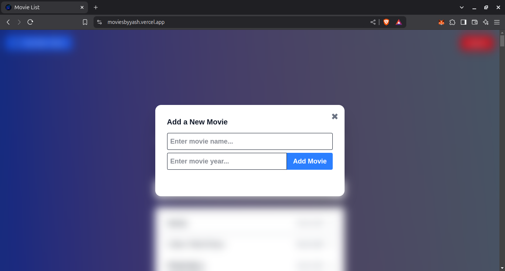
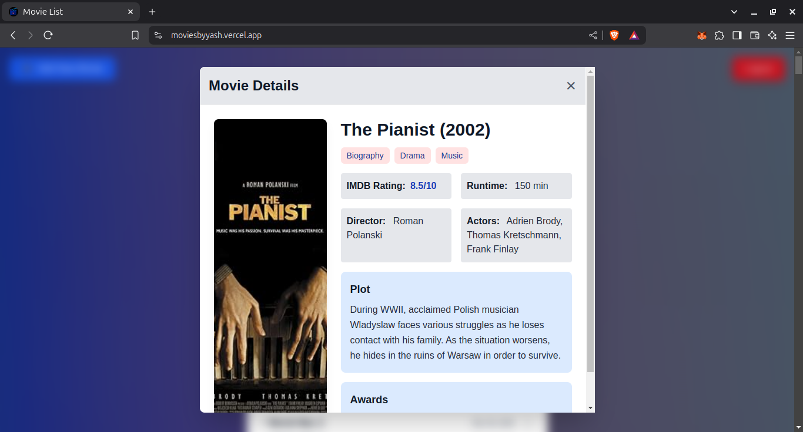
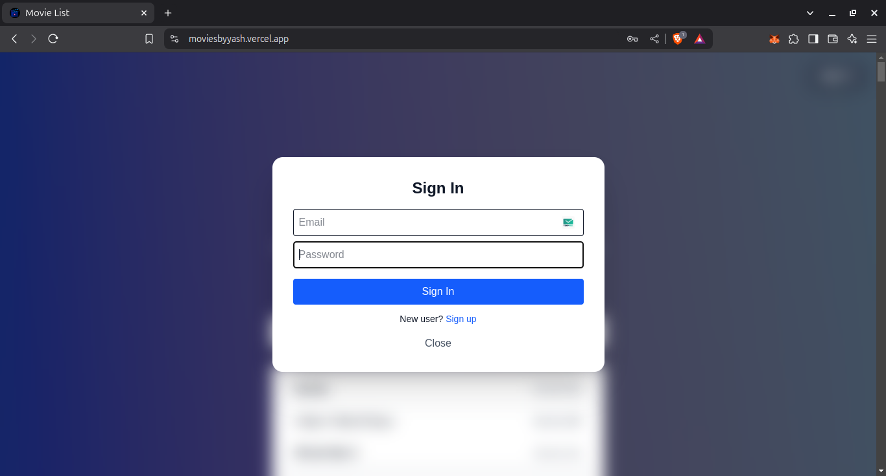

# Movie List

A simple movie list application built using Next.js, Firebase, and the OMDB API. The app allows an admin to add and remove movies, fetches movie details using the OMDB API, and optimizes performance by caching movie data.

## Project Domain

- **Live Application:** [moviesbyyash.vercel.app](https://moviesbyyash.vercel.app/)

## Features

- **Admin-Only Movie Management**: Uses Firebase Authentication to restrict movie additions and deletions to admin users.
- **Movie Storage in Firebase**: Movie names are stored in Firebase, preventing duplicate entries.
- **Optimized Data Fetching**: Movies are fetched from Firebase and cached, updating only when the backend changes. This reduces unnecessary database queries and improves performance.
- **Automatic Title Formatting**: Movie names are stored in title case (first letter of every word capitalized).
- **Efficient Movie Search**: The search feature is optimized for fast results.
- **Sorted Movie Display**: Movies are displayed in order of addition, with the newest at the top and the oldest at the bottom.
- **Hosted on Vercel**: The project is deployed using Vercel for seamless hosting.

## Technologies Used

- **Next.js** - Frontend framework
- **Firebase** - Database and authentication
- **OMDB API** - Fetching movie details
- **Vercel** - Hosting

## Getting Started

### Prerequisites

Make sure you have the following installed on your machine:

- Node.js (latest LTS recommended)
- Firebase account and project setup
- OMDB API key

### Installation and Setup

1. **Clone the Repository**

   ```sh
   git clone https://github.com/yourusername/movie-list.git
   cd movie-list
   ```

2. **Install Dependencies**

   ```sh
   npm install
   ```

3. **Set Up Environment Variables**
   Create a `.env.local` file in the root directory and add the following:

   ```env
   NEXT_PUBLIC_FIREBASE_API_KEY=your_firebase_api_key
   NEXT_PUBLIC_FIREBASE_AUTH_DOMAIN=your_firebase_auth_domain
   NEXT_PUBLIC_FIREBASE_PROJECT_ID=your_firebase_project_id
   NEXT_PUBLIC_FIREBASE_STORAGE_BUCKET=your_firebase_storage_bucket
   NEXT_PUBLIC_FIREBASE_MESSAGING_SENDER_ID=your_firebase_messaging_sender_id
   NEXT_PUBLIC_FIREBASE_APP_ID=your_firebase_app_id
   NEXT_PUBLIC_OMDB_API_KEY=your_omdb_api_key
   ```

4. **Run the Development Server**

   ```sh
   npm run dev
   ```

   The project will be available at `http://localhost:3000`.

5. **Build and Deploy to Vercel**
   ```sh
   npm run build
   vercel deploy
   ```

## Screenshots






## Contribution

Feel free to contribute by submitting issues or pull requests.

## License

This project is licensed under the MIT License.

## Contact

For any inquiries, reach out via GitHub, LinkedIn: [linkedin.com/in/yashk194](https://www.linkedin.com/in/yashk194/) or email at `yashkm194@gmail.com`.
